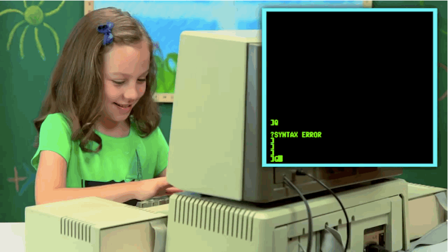

theme: Sketchnote

# [fit] 10x Command Line-Fu

## [fit] How to look cooler at Starbucks

## [fit] How to understand more XKCD comics

<br>

### [fit] https://github.com/epylinkn/itp-command-fu

---


---

## Why am I here? Why practice command-fu?

- You use the command line at work
- You use it to bootstrap your code projects
- Automating tasks you do frequently
- Anthony seems like a cool guy I wonder what he has to say

---

> The command line is incredibly expressive and powerful. It can help you be more productive and automate mundane tasks.

---

## Our Roadmap

- standard unix bash commands
- chaining, pipes and output redirection
- alias, shell functions, and your first shell script
- scripting with javascript
- cron, `.bashrc`, and `.bash_profile`
- homebrew - the package manager for OSX

---

## /bin/bash

Mac's run Unix.
Developers love Unix.
Unix is awesome.
You can be awesome.

---

## Standard unix bash commands

### The basics

```
cd - change directory
ls - list files
pwd - current working directory
cp - copy
mv - move
mkdir - make directory
rm - remove
cat - concatenate
```

^ We won't cover these because I expect you already know these elementary commands. And if you don't know them now might be a good time to leave. J/K but you can follow along with the examples and pick up some practice with these too.

---

## Standard unix bash commands

### More advanced commands

```
say
history
head / tail
curl
time
watch
grep
find
xargs
ssh
```

---

## Structure of a command

```bash
$ command --option option_argument x (y z ...)
```

---


---

# [fit] `tar czvf myTarball.tar.gz .`

---

## `say` cheese

Simple command to make terminal say something.

```
say why cant we be friends
```

Extra credit:

```
say --voice ?
say --voice "Bad News" The light you see at the end of the tunnel is the
headlamp of a fast approaching train.
```

---

## `history` repeats itself

```
history
echo goodbye world
history
!-2
history
```

---

## `heads` or `tails`

```
head camp.txt
head -n50 camp.txt
tail camp.txt
```

Extra Credit:

```
tail -f camp.txt
echo foo >> camp.txt
```

---

## [fit] `alias` and your first shell script!

---

## `curl`*y* fries

```bash
curl itpcalendar.herokuapp.com/calendar
curl wttr.in
open -a "Google Chrome" http://wttr.in
curl -I ideas.ted.com
```

#### Extra Credit

```bash
curl -XPOST slack webhook
curl -o itp-calendar.html http://itp.nyu.edu/camp2016/session/238
# copy a cURL command from chrome inspector
```

---

## Steal an entire site with wget

http://www.linuxjournal.com/content/downloading-entire-web-site-wget

```bash
$ wget \
     --recursive \
     --no-clobber \
     --page-requisites \
     --html-extension \
     --convert-links \
     --restrict-file-names=windows \
     --domains blankslate.io \
     --no-parent \
         blankslate.io
```

---

## Chaining commands

```
false || echo "Oops, fail"
# => Oops fail

true || echo "Will not be printed"
# => 

true && echo "Things went well"
# => Things went well

false ; echo "This will always run"
# => This will always run
```

---

# Output redirection

```
<
# The < will take and send the input from the file on the right to the
program on the left.

>
# The > takes the output of the command on the left, then writes it
to the file on the right.

>>
# The >> takes the output of the command on the left, then appends it
to the file on the right.

|
# The | takes the output from the command on the left, and "pipes" it to
the command on the right.
```

---

## pipe

"pipe" the output of one command into the input of a second command

```
cat ~/.bash_history | grep say | tail -n20
```

---

## `crontab -e`

```
# Examples
*/1 * * * * say 'super duper'

# Use a login shell so that our ~/.bash_profile gets loaded
*/1 * * * * /bin/bash -lc "/Users/anthony/me/itp/command-fu/03-superbole.js"
```

---


---

# [fit] Homebrew

## [fit] The missing package manager for OS X

---


---

## Some homebrew recommendations

Some homebrew recommendations:

```
brew update
brew install wget
wget https://cdn.rawgit.com/epylinkn/itp-command-fu/master/commandfu.pdf
brew install tree
tree .
brew install jq
curl itpcalendar.herokuapp.com/calendar | jq '.[].title'

# faster and more configurable command-line search
brew install the_silver_searcher
```

---

## Brew Cask

```
brew install cask
brew cask info p5
brew cask install p5
open -a 'p5'
brew cask uninstall p5

brew cask search unity
brew cask install unity
```

---


---

# Resources

- https://github.com/jlevy/the-art-of-command-line
- https://github.com/veltman/clmystery


